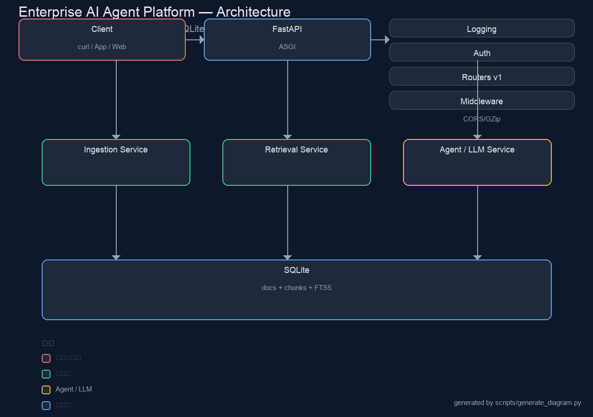

# Enterprise AI Agent Platform

企業級「RAG + Agent」平台——一個可以直接跑喺自己 Mac / 公司伺服器嘅 AI 知識庫問答系統。支援**多 LLM 供應商**（DeepSeek / OpenAI / 本地 Ollama）、**檢索增強生成（RAG）**、文件向量索引、企業級設計（分層架構、Docker、CI、測試、API Key 認證、結構化日誌）。



---

## 呢個項目有咩

| 功能 | 說明 |
|------|------|
| 📄 **文件索引** | 上傳 Markdown / TXT / PDF，自動切分＋索引 |
| 🔍 **檢索增強生成** | SQLite FTS5 全文檢索（零外部依賴）＋可選 Embedding 向量檢索 |
| 🤖 **多 LLM 支援** | DeepSeek / OpenAI / Ollama（本地）／無 Key 規則引擎 fallback |
| 🧠 **Agent 循環** | 系統提示＋工具調用（工具：檢索、現時時間、計算） |
| 🔐 **API Key 認證** | 企業級 Bearer Token 保護所有端點 |
| 📝 **結構化日誌** | JSON 日誌，可直接接入 Loki / ELK |
| 🐳 **容器化** | Dockerfile + docker-compose，一行起機 |
| ✅ **測試** | pytest 單元＋整合測試（唔使真 LLM） |
| ⚙️ **CI** | GitHub Actions：lint + test + build |

---

## 快速開始

### 1. 安裝

```bash
python3 -m venv .venv
source .venv/bin/activate
pip install -r requirements.txt
cp .env.example .env
```

### 2. 起伺服器

```bash
# 無 LLM Key 都得（用規則引擎，免費試到成個流程）
uvicorn app.main:app --reload --port 8000

# 或者用 Docker（企業部署方式）
docker compose up --build
```

### 3. 使用

```bash
# 設定 API Key（.env 入面）
export AGENT_API_KEY=dev-secret-key

# 上傳文件（建索引）
curl -X POST http://localhost:8000/api/v1/ingest \
  -H "Authorization: Bearer dev-secret-key" \
  -F "file=@README.md" \
  -F "namespace=support"

# 問問題（RAG 回答）
curl -X POST http://localhost:8000/api/v1/query \
  -H "Authorization: Bearer dev-secret-key" \
  -H "Content-Type: application/json" \
  -d '{"question":"呢個平台有咩功能？","namespace":"support"}'
```

互動文檔（OpenAPI）：<http://localhost:8000/docs>

---

## 架構

```
                        ┌─────────────────────┐
                        │      Client         │
                        │ (curl / App / Web)  │
                        └──────────┬──────────┘
                                   │ Bearer Token
                                   ▼
┌──────────────────────────────────────────────────────────┐
│                     FastAPI (ASGI)                        │
│  ┌──────────┐ ┌──────────┐ ┌──────────┐ ┌─────────────┐  │
│  │ Logging  │ │ Auth     │ │ Routers  │ │ Middleware  │  │
│  │ (JSON)   │ │ (Bearer) │ │ v1       │ │ (CORS/GZip) │  │
│  └──────────┘ └──────────┘ └──────────┘ └─────────────┘  │
└──────────────────────────────────────────────────────────┘
                                   │
         ┌─────────────────────────┼─────────────────────────┐
         ▼                         ▼                         ▼
  ┌───────────────┐        ┌───────────────┐         ┌────────────────┐
  │   Ingestion   │        │   Retrieval   │         │   Agent / LLM  │
  │ Service       │        │ Service       │         │ Service        │
  │ - 切分/清洗   │        │ - FTS5 全文   │         │ - Provider 抽象│
  │ - 儲存 SQLite │        │ - 排序/過濾   │         │ - 工具調用     │
  └───────────────┘        └───────────────┘         └────────────────┘
         │                         │                          │
         ▼                         ▼                          ▼
  ┌───────────────────────────────────────────────────────┐
  │              SQLite (documents + chunks + FTS5)       │
  └───────────────────────────────────────────────────────┘
```

**設計原則**：分層清晰（Router → Service → Repository），每層獨立可測試；所有外部依賴（LLM）都透過抽象介面，換供應商唔使改核心邏輯。

---

## 項目結構

```
enterprise-ai-agent/
├── app/
│   ├── main.py            # FastAPI 入口（生命週期、CORS、掛載路由）
│   ├── config.py          # 設定管理（pydantic-settings，讀 .env）
│   ├── models/
│   │   └── schemas.py     # Pydantic 請/響應模型
│   ├── routers/
│   │   ├── health.py      # /health 存活＋就緒檢查
│   │   ├── ingest.py      # /ingest 文件上傳建索引
│   │   └── query.py       # /query 問答（RAG）
│   ├── services/
│   │   ├── ingestion.py   # 文件切分、清洗、寫入 SQLite
│   │   ├── retrieval.py   # FTS5 檢索＋重排
│   │   ├── llm.py         # LLM Provider 抽象（DeepSeek/OpenAI/Ollama/Rule）
│   │   └── agent.py       # Agent 循環（提示詞＋工具調用）
│   └── middleware/
│       └── logging.py     # 請求日誌（JSON 結構化）
├── scripts/
│   └── generate_diagram.py   # 用 PIL 畫架構圖（docs/architecture.png）
├── tests/
│   └── test_api.py        # pytest 整合測試
├── Dockerfile
├── docker-compose.yml
├── .env.example
├── requirements.txt
├── Makefile
└── README.md
```

---

## 設定（.env）

| 變數 | 預設 | 說明 |
|------|------|------|
| `AGENT_API_KEY` | `dev-secret-key` | 客戶端 API Key（生產請改強密碼） |
| `LLM_PROVIDER` | `rule` | `deepseek` / `openai` / `ollama` / `rule` |
| `DEEPSEEK_API_KEY` | - | DeepSeek Key |
| `DEEPSEEK_BASE_URL` | `https://api.deepseek.com` | DeepSeek API 端點 |
| `DEEPSEEK_MODEL` | `deepseek-chat` | DeepSeek 模型名 |
| `OPENAI_API_KEY` | - | OpenAI Key |
| `OPENAI_MODEL` | `gpt-4o-mini` | OpenAI 模型名 |
| `OLLAMA_BASE_URL` | `http://localhost:11434` | 本地 Ollama |
| `OLLAMA_MODEL` | `qwen2.5:7b` | Ollama 模型名 |
| `DB_PATH` | `agent.db` | SQLite 檔案位置 |
| `CORS_ORIGINS` | `*` | 允許來源（逗號分隔） |

---

## 測試

```bash
pytest -v
```

測試用**假 LLM**，唔使網絡唔使 Key，CI 直接跑。

---

## 部署

### Docker（推薦）

```bash
docker compose up --build -d
# 確認健康
curl http://localhost:8000/health/live
```

### 手動（systemd 例子）

```ini
[Unit]
Description=Enterprise AI Agent
After=network.target

[Service]
User=www-data
WorkingDirectory=/opt/enterprise-ai-agent
ExecStart=/opt/enterprise-ai-agent/.venv/bin/uvicorn app.main:app --host 0.0.0.0 --port 8000 --workers 2
Restart=always

[Install]
WantedBy=multi-user.target
```

---

## 常見問題

**Q：冇 LLM Key 點試？**
A：用預設 `rule` provider——引擎會直接返回「檢索到嘅證據＋答案」，成條 RAG 流程照跑，純體驗。

**Q：支援 PDF 嗎？**
A：支援。`ingestion.py` 會自動偵測副檔名，PDF 用 `pypdf` 抽文字（需 `pip install pypdf`）。

**Q：想加其他 LLM？**
A：喺 `services/llm.py` 加一個新 Provider class（繼承 `BaseLLM`）就搞掂，幾十行。

**Q：Embedding 向量檢索點開？**
A：需要 `sentence-transformers`（會下載模型）。開啟後同時用 FTS5＋向量兩路檢索再合併，準確度更高。預設唔開，因為要下載模型。

---

## 授權

MIT License